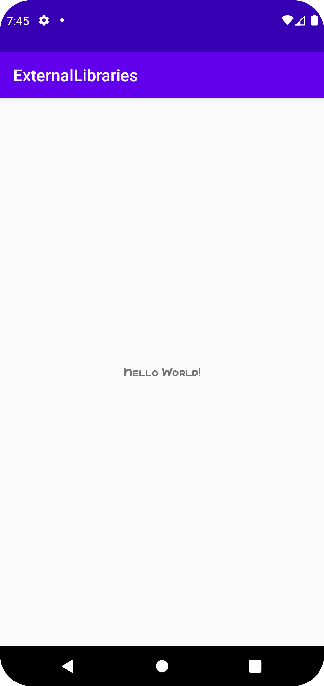

# Rapport

Lade till det externa biblioteket "FontometricsLibrary" i "dependencies".

```
    implementation 'org.ishmeetsingh.androbot:fontometrics:1.0.0'
```

Satte ID "text" på "TextView" i layouten för "MainActivity".

```
        android:id="@+id/text"
```

Importerade det som skulle användas.

```
import android.widget.TextView;

import com.example.fontometrics.Fontometrics;
```

Deklarerade en "TextView".

```
    private TextView textView;
```

Ändrade typsnittet på en "TextView" i layouten för "MainActivity" med hjälp av det externa biblioteket "FontometricsLibrary".

```
        textView = findViewById(R.id.text);
        textView.setTypeface(Fontometrics.elephant(this));
```

Skärmdump av "Hello World!" i det nya typsnittet som ändrades med det externa biblioteket.

